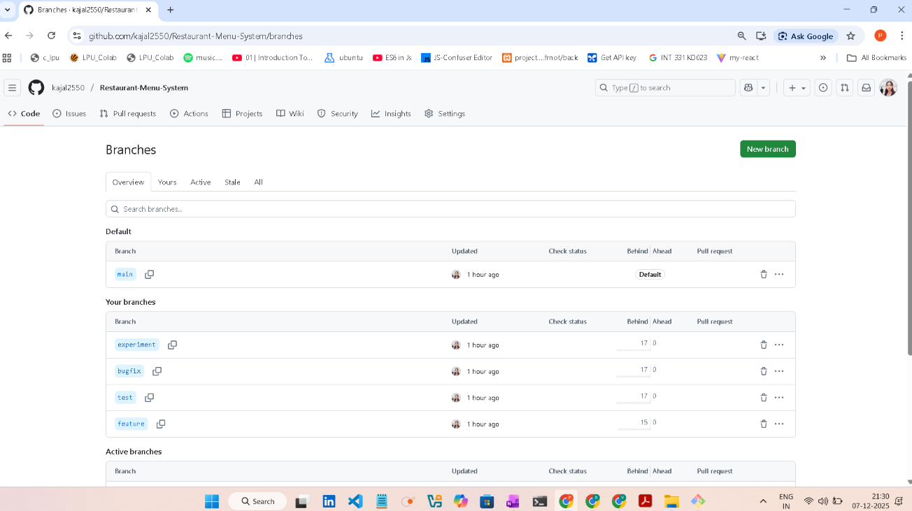

 # 🍽️ Restaurant Menu System

This project demonstrates a complete web-based Restaurant Menu System along with version control using Git and GitHub. It includes branching, merging, commit history tracking, resolving merge conflicts, and remote repository hosting — following a real development workflow.

---

## 📌 Features

- 🔍 Searchable food items  
- 🍔 Menu cards with images & price  
- ⭐ Customer review slider  
- 🛒 Order button functionality  
- 📱 Responsive and modern UI  

---

## 🛠️ Technologies Used

| Technology | Purpose |
|-----------|---------|
| HTML | Structure of webpage |
| CSS | Styling and layout |
| JavaScript | Search and slider functionality |
| Git | Version control |
| GitHub | Remote hosting |
| VS Code | Code editor |

---

## 🚀 Git Workflow Documentation

### **Repository Setup**
```bash
git init
```

### **Adding Files & First Commit**
```bash
git add .
git commit -m "Initial Commit: Added basic project structure"
```

---

## 🌿 Branching Strategy

| Branch Name | Purpose |
|------------|---------|
| `main` | Final production version |
| `feature-ui` | UI layout & styling changes |
| `test-js` | Testing JavaScript functionality |
| `bugfix-search` | Fixes related to search bar |
| `experiment-design` | Trying new design ideas |

---

## 🔀 Merge Operations

```bash
git checkout main
git merge feature-ui
git merge test-js
git merge bugfix-search
git merge experiment-design
```

---

## ⚠️ Merge Conflict Example & Resolution

Conflict occurred during:

```bash
git merge experiment-design
```

### Steps taken:
1. Conflict identified in `index.html`
2. Edited the file manually to keep correct version
3. Staged and committed resolved file

```bash
git add index.html
git commit -m "Resolved merge conflict in index.html"
```

---

## 🌍 Remote Repository Setup

```bash
git remote add origin https://github.com/kajal2550/Restaurant-Menu-System.git
git push -u origin main
```

---

## 📸 Screenshots (To be attached by student)
 
 ### 📸 Screenshots

---
 #### 📁 Folder Structure


---

#### 🟢 Git Init bash


---

#### 🌿 Branches Created Screenshot


---

#### 🧱 Commit Progress Screenshot


---

#### 🏠 GitHub Repository Home


---

#### 🔀 Branches View + First Commit Confirmation


---

#### 📊 Git Log History Graph


---

#### ⚠️ Merge Conflict Screen


---

#### ✅ Resolved Conflict Screen


---

#### 🎯 Final push


---

## 💻 Commands Used Summary

```
git init  
git add .  
git commit -m "Message"  
git branch  
git checkout branchname  
git merge branchname  
git push origin main  
git pull origin main  
```
or 

mkdir restaurant-menu-system
cd restaurant-menu-system

git init
git status

git add .
git commit -m "Initial commit"

git branch -M main

git branch experiment
git branch test

git checkout experiment
git add .
git commit -m "Work done on experiment branch"

git checkout test
git add .
git commit -m "Work done on test branch"

git checkout main
git merge --no-ff experiment
git merge --no-ff test

git remote add origin https://github.com/kajal2550/Restaurant-Menu-System.git
git remote -v

git push -u origin main

---

## 🧠 Challenges Faced

- Understanding merge conflicts initially was confusing  
- remembering branching workflow took practice  
- pushing remote repository for first time required setup  
But after multiple tries, the workflow became easier and smooth.

---

## 🎯 Conclusion

This project helped in understanding the complete Git and GitHub workflow along with web development. It improved skills in version control, branching, merging, working with conflicts, and remote repository management. The final result is a fully functional and professionally documented project.

---

## 🔗 GitHub Repository Link

👉 (Paste after pushing)  
```
https://github.com/kajal2550/Restaurant-Menu-System
```

---

## 👤 Student Information

| Field | Details |
|-------|---------|
| **Name** | Kajal Kumari |
| **Roll No.** | 40 |
| **Course Code** | INT331 |
| **Course Title** | Web Development & Git Version Control |
| **Department** | CSE |
| **Session** | 2025-26 |
| **Submitted To** | Dr. Harpreet Kaur |

📝 Future Scope: This project can be extended with payment gateway and user login.

📍 Update: More features will be added in future releases.

---

✨ **Thank you!**
